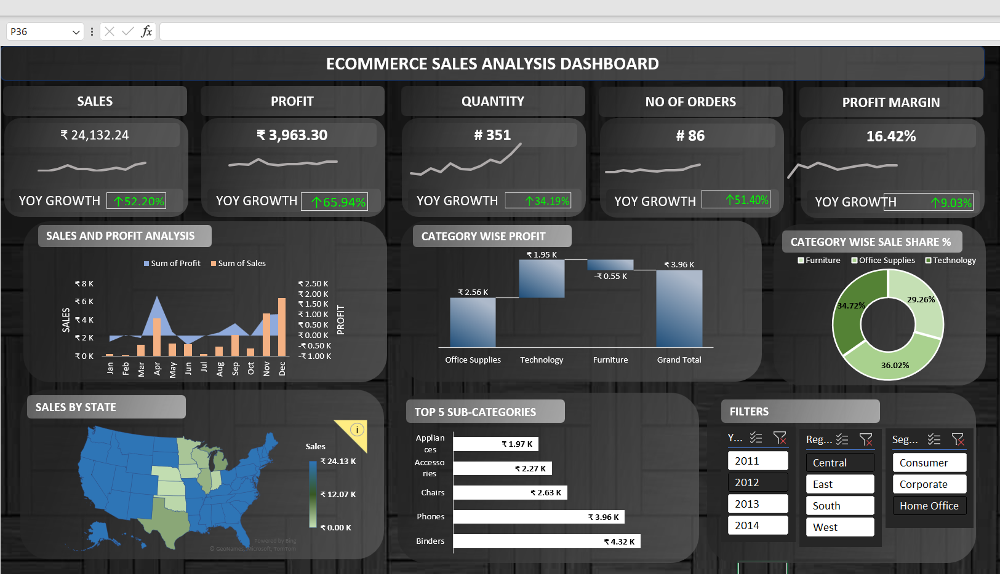

# 📊 Sales Dashboard in Excel

## 📌 Overview

This project focuses on analyzing and visualizing sales data using Microsoft Excel. The goal is to generate meaningful insights and create an interactive dashboard for better decision-making.

---

## 🎯 Objectives

* Clean and organize raw data
* Analyze key metrics
* Build an interactive dashboard
* Present insights visually

---

## 🛠️ Tools Used

* Microsoft Excel
* Pivot Tables
* Conditional Formatting
* Charts & Graphs

---

## 📂 Dataset

Source: https://docs.google.com/spreadsheets/d/1L6aBX0uNlzKiJb7JHdkNUile18s9CI4r/edit?gid=1589100670#gid=1589100670

---

## 🔍 Key Steps

1. Data Cleaning (removed duplicates, fixed dates, cleaned text)
2. Data Transformation
3. Created Pivot Tables
4. Built Dashboard with slicers and charts

---

## 📈 Insights

* The West region contributed the highest overall sales, indicating strong market demand and better regional performance compared to other regions.

* The Technology category generated the highest profit, making it the most valuable segment for business growth.

* High discount levels in certain transactions resulted in negative profits, highlighting the need for better discount control strategies.

* Repeat customers and bulk orders played an important role in driving revenue, suggesting the importance of customer retention strategies.

## 💡 Recommendations

* Reduce excessive discounts on low-margin products to prevent losses
* Focus more on Technology category to maximize profitability
* Improve pricing strategy for loss-making sub-categories like Tables
* Strengthen presence in high-performing regions like West

---

## 📸 Dashboard Image

---

## 🚀 Outcome

This project demonstrates my ability to clean data, analyze it, and build professional dashboards using Excel.

---

## 🔗 Connect with Me

LinkedIn: https://www.linkedin.com/in/udit-narayan-jena04/
